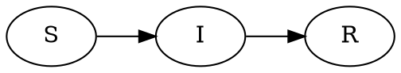

The goal of this notebook is to derive the $Q$ matrix (aka. Infinetestimal generator matrix) from data generated by a Gillespie simulated CTMC model of a SIR disease process. 

To begin, lets define the model.

* The SIR compartmental model features 3 compartiments (Susceptible, Infectious, and Recovered) though which N individuals progress (i.e. $S + I + R = N$).  A single individual here can only move to the next compartiment (i.e. from Susceptible to Infectious, or from Infectious to Recovered). 

* These to possible events (S -> I and I -> R) can be represented by a change in the global state  variable $X(t) = \{s,i\}$ (which I read as "system $X$ at time $t$ has $s$ susceptible and $i$ infectious individuals"), with an infection after time $\Delta t$ giving  $X(t + \Delta t) = \{s-1, i + 1\}$ and  recovery $X(t + \Delta t) = \{s, i-1\}$.

* The probability that a susceptible individual will become infected $p_{\{s-1, i+1\} \leftarrow \{s, i\}} = p_{i+1} = \frac{\beta\times s\times i}{N}$

If we are working in discrete time, these probabilities are all we need to specify the dynamics of the system. At each time step, a random process decides which event will occur according to p__ and p__. 

in continuous time, however, the length of each time step, \delta t, is also random, and we need to specify how it will be realised. To do this we note without proof the the length of time between events will be exponentially distributed. We can then define the 'holding time', Ti ~ Exponenial(q_i), as the time (on average 1/q_i units) that a CTMC starting in state i stays in i before transitioning to some different state j. 

q