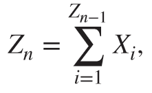
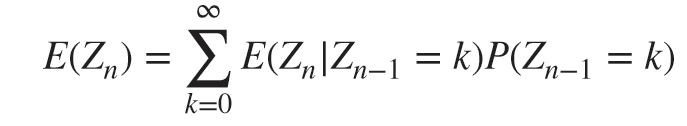
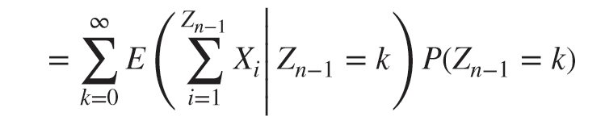
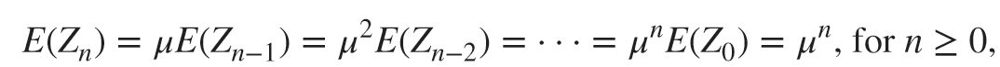
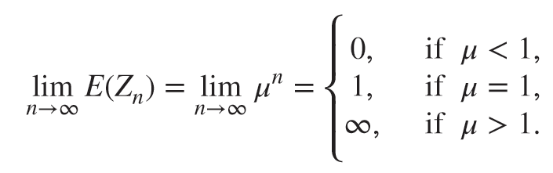
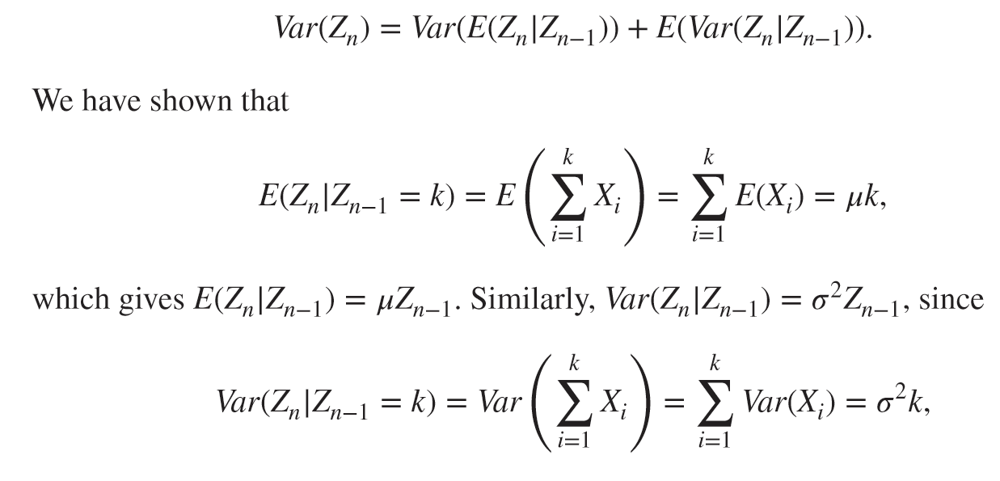
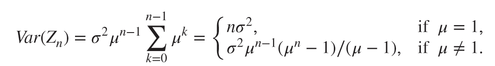
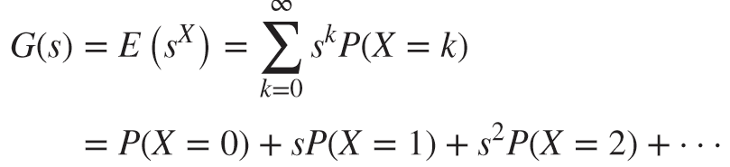

# Annotations (1/28/2023, 4:14:06 PM)

<a href="zotero://open-pdf/library/items/PVWS76IN?page=183&#x26;annotation=PXJDHAW4">“Lemma 4.1. In a branching process, all nonzero states are transient.”</a> (<a href="zotero://select/library/items/I5WBS4XD">Dobrow</a>)

<a href="zotero://open-pdf/library/items/PVWS76IN?page=184&#x26;annotation=F7A5XIJZ">“Since all nonzero states are transient and the chain has ininite state space, there are two possibilities for the long-term evolution of the process: either it gets absorbed in state 0, that is, the population eventually goes extinct, or the population grows without bound.”</a> (<a href="zotero://select/library/items/I5WBS4XD">Dobrow</a>) note link: "zotero://note/u/VNF593F4/"

<a href="zotero://open-pdf/library/items/PVWS76IN?page=184&#x26;annotation=DSS9GUTQ">“In a branching process, the size of the nth generation is the sum of the total offspring of the individuals of the previous generation”</a> (<a href="zotero://select/library/items/I5WBS4XD">Dobrow</a>)

\
(<a href="zotero://select/library/items/I5WBS4XD">Dobrow</a>) Zn is a random sum of IID random variables\
\$Z \_ { n } = \sum \_ { i = 1 } ^ { Z \_ { n - 1 } } ^ { Z \_ { i } }\$\
note link: "zotero://note/u/DZCC3ZSS/"

\
(<a href="zotero://select/library/items/I5WBS4XD">Dobrow</a>) \$E ( Z \_ { n } ) = \sum \_ { k = 0 } ^ { \infty } E ( Z \_ { n } | Z \_ { n - 1 } = k ) P ( Z \_ { n - 1 } = k )\$

\
(<a href="zotero://select/library/items/I5WBS4XD">Dobrow</a>)

\
(<a href="zotero://select/library/items/I5WBS4XD">Dobrow</a>) \$E ( Z \_ { n } ) = u E ( Z \_ { n - 1 } ) = u ^ { 2 } E ( Z \_ { n - 2 } ) = \cdots = u ^ { n } E ( Z \_ { 0 } ) = H ^ { n } , n \geq 0\$

\
(<a href="zotero://select/library/items/I5WBS4XD">Dobrow</a>) long-term expected generation size\
\
\$\lim \_ { n \rightarrow \infty } E ( Z \_ { n } ) = \lim \_ { n \rightarrow \infty } u ^ { n } = \\{ \begin{array} { l l } { 0 , } & { u \lt 1 } \\\ { 1 , } & { u \lt 1 } \\\ { \infty , } & { u \gt 1 } \end{array}\$

<a href="zotero://open-pdf/library/items/PVWS76IN?page=185&#x26;annotation=7TCSCDKA">“A branching process is said to be subcritical if 󑰀&#x3C;1, critical if 󑰀 = 1, and supercritical if 󑰀>1”</a> (<a href="zotero://select/library/items/I5WBS4XD">Dobrow</a>)

<a href="zotero://open-pdf/library/items/PVWS76IN?page=185&#x26;annotation=KB5ZCKQB">“For a subcritical branching process, mean generation size declines exponentially to zero. For a supercritical process, mean generation size exhibits long-term exponential growth. The limits suggest three possible regimes depending on 󑰀: long-term extinction, stability, and boundless growth.”</a> (<a href="zotero://select/library/items/I5WBS4XD">Dobrow</a>)

<a href="zotero://open-pdf/library/items/PVWS76IN?page=186&#x26;annotation=YM6P7V55">“in the general supercritical case, the probability that the population eventually dies out is less than one, but typically greater than zero”</a> (<a href="zotero://select/library/items/I5WBS4XD">Dobrow</a>)

<a href="zotero://open-pdf/library/items/PVWS76IN?page=187&#x26;annotation=D7Z9NJJN">“With probability 1, a subcritical branching process eventually goes extinct”</a> (<a href="zotero://select/library/items/I5WBS4XD">Dobrow</a>)

<a href="zotero://open-pdf/library/items/PVWS76IN?page=187&#x26;annotation=TMHV8B6P">“Subcritical branching processes have been used to model the spread of infections and disease in highly vaccinated populations. Farrington and Grant (1999) cite several examples, including the spread of measles and mumps, the outbreak of typhoidal salmonellae reported in Scotland in 1967–1990, and outbreaks of human monkeypox virus in past decades. Becker (1974) inds evidence of subcriticality in European smallpox data from 1950 to 1970. Often the goal of these studies is to use data on observed outbreaks to estimate the unknown mean offspring parameter 󑰀 as well as the number of generations of spread until extinction”</a> (<a href="zotero://select/library/items/I5WBS4XD">Dobrow</a>)

\
(<a href="zotero://select/library/items/I5WBS4XD">Dobrow</a>) By the law of total variance

\
(<a href="zotero://select/library/items/I5WBS4XD">Dobrow</a>) $\operatorname { V a r } ( Z _ { n } ) = o ^ { 2 } A ^ { n - 1 } \sum _ { k = 0 } ^ { n - 1 } A ^ { k } = \{ \begin{array} { l } { n _ { 0 } ^ { 2 } } \\ { 0 ^ { 2 } a ^ { n - 1 } ( \alpha ^ { n } - 1 ) / ( u - 1 ) , u \neq 1 } \end{array}$

<a href="zotero://open-pdf/library/items/PVWS76IN?page=188&#x26;annotation=7TT4DXNR">“For a discrete random variable X taking values in {0, 1, ...},theprobability generating function of X is the function”</a> (<a href="zotero://select/library/items/I5WBS4XD">Dobrow</a>) The function is a power series whose coeficients are probabilities.

\
(<a href="zotero://select/library/items/I5WBS4XD">Dobrow</a>) $\left. \begin{array} { l } { G ( s ) = E ( s ^ { X } ) = \sum _ { k = 0 } ^ { \infty } s ^ { k } P ( X = k ) } \\ { = P ( X = 0 ) + s P ( X = 1 ) + s ^ { 2 } P ( X = 2 ) + \cdots } \end{array} \right.$

<a href="zotero://open-pdf/library/items/PVWS76IN?page=188&#x26;annotation=SL2ATAVL">“The generating function represents the distribution of a discrete random variable as a power series. If two power series are equal, then they have the same coeficients. Hence, if two discrete random variables X and Y have the same probability generating function, that is, GX(s)=GY (s) for all s, then X and Y have the same distribution.”</a> (<a href="zotero://select/library/items/I5WBS4XD">Dobrow</a>)
